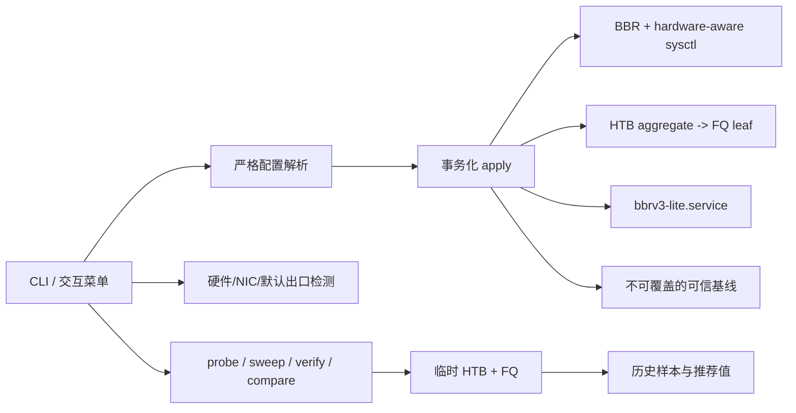

# BBRv3 Lite

BBRv3 Lite 是面向 Debian/Ubuntu VPS 的可测量 TCP 调优工具。它把原项目中可靠的 XanMod 安装、BBR/FQ、DNS/IPv6 管理、严格配置、持久化与回滚重新实现，并吸收 tcpfit 的机器画像、iperf3 测量、policer 拐点扫描、并发锁和最早基线保护。

当前版本：v7.2.0

项目不追求“sysctl 越多越好”。默认配置保持克制。命令行 `measure` 只给出结果；交互式 `auto` 会在一次总确认后完成测量、决策、应用和复验，未发现可信拐点时保持纯 FQ。

## 核心能力

- BBR + FQ 基础调优，以及按 CPU、内存、网卡队列、可信链路速率、实测带宽和业务 RTT 计算的硬件感知调优模型。
- 覆盖 256 MiB 小型 VPS 到 100G 级服务器的分档预算：低内存机降低缓冲区下限，高 BDP/大内存机按需放宽到约 2 GiB 的 Linux signed-sysctl 边界；listen/SYN backlog 与 `netdev_max_backlog` 同步按资源上限分级。
- `HTB root -> FQ leaf` 接口聚合出口整形，不用 FQ `maxrate` 冒充总限速。
- `iperf3 -J` JSON 探测、粗扫、细扫、边界复测和测速流量统计；同时记录负载 RTT p95、bufferbloat、每 GiB 重传、全机/峰值单核 CPU、steal 与后台流量污染。
- 基准档和最终复验采用 2–3 次自适应采样；离散度过高会自动补样，持续不稳定或受污染时停止并回滚，不拿可疑样本生成推荐值。
- 安全的 `measure compare` 交错 A/B 对照 FQ 与指定 HTB/FQ 速率，输出吞吐、负载延迟、标准化重传、置信度和结论，结束后恢复原 qdisc 且不持久化。
- 三问式自动向导：带宽、测速对端、业务用途；执行前集中展示耗时、流量和落盘位置。
- 公共 iperf3 节点先按 RTT 筛选，再用低流量真实会话排除繁忙或伪开放端口；正式样本短暂失败会自动重试。
- 交互式子菜单会停留在当前模块，结果确认后再清屏重绘；只有选择 `0` 才返回主菜单。
- IPv4 优先、IPv6 兜底的默认出口检测；不会遍历修改 Docker/veth/bridge 接口。
- 全局 `flock`，防止两个进程同时修改 sysctl、qdisc 或配置。
- 严格 `KEY=VALUE` 白名单解析，配置文件从不被 shell `source`。
- CLI 对每个子命令分别校验选项、参数数量和值域；缺值、溢出整数和会被静默忽略的选项直接拒绝。
- 首次可信基线以完成标记原子提交，不完整快照不会被误当成可信基线；测试中断或应用失败时恢复操作前 qdisc。
- 一个配置、一个 systemd 服务、一个发布脚本，不产生竞争 root qdisc 的服务。
- 官方 XanMod APT 安装、Secure Boot/容器检查、CPU level 保守选择和 APT 网络组件保护。
- DNS 和 IPv6 各自使用原子基线和本次操作快照；应用失败恢复本轮开始前状态，不把无关系统改动塞进一次“大回滚”。

## 架构



仓库源码位于 `src/`，发布时由 `scripts/build.sh` 按固定顺序生成根目录的 `net-tcp-tune.sh`。用户仍然可以只下载一个文件，维护和测试则按模块进行。

## 安装

推荐使用下面这一行：安装最新 GitHub Release、校验 `SHA256SUMS`，然后直接打开菜单：

```bash
curl -fsSL https://raw.githubusercontent.com/ike-sh/bbrv3-lite/main/install-alias.sh | bash -s -- --run
```

`--run` 使用安装后的绝对路径启动，并从 `/dev/tty` 重新接入交互输入，因此不会被旧版同名 shell 函数遮蔽。只安装、不进入菜单时去掉 `--run`，随后执行 `bbr version`。

如果仓库已有版本 tag、但 GitHub Release 资产尚未生成，安装器会明确提示并从同一个不可变 tag 下载脚本和校验文件。它不会静默退回可变的 `main`。安装完成后若旧版 shell 函数仍遮蔽 `/usr/local/bin/bbr`，执行：

```bash
unset -f bbr 2>/dev/null
hash -r
```

测试尚未发布的 `main` 分支时必须显式选择 channel；它同样校验仓库中的 `SHA256SUMS`：

```bash
bash /tmp/install-bbrv3-lite.sh --channel main
```

root 用户默认安装到 `/usr/local/bin/bbr`；普通用户安装到 `~/.local/bin/bbr`。普通用户仍需使用 `sudo bbr ...` 执行会修改系统的命令。

安装器要求 `--prefix` 是绝对目录，并且不会覆盖或卸载缺少本项目标记的同名 `bbr` 文件。`uninstall` 只接受 `--prefix`，避免把安装参数静默误用到删除流程。

也可以直接下载单文件：

```bash
curl -fsSLO https://github.com/ike-sh/bbrv3-lite/releases/latest/download/net-tcp-tune.sh
curl -fsSLO https://github.com/ike-sh/bbrv3-lite/releases/latest/download/SHA256SUMS
sha256sum -c SHA256SUMS --ignore-missing
chmod +x net-tcp-tune.sh
sudo ./net-tcp-tune.sh status
```

## 推荐流程

### 最省事：自动向导

```bash
sudo bbr auto
# 或直接运行 sudo bbr 选择 1
```

向导只集中询问三类信息：标称带宽（可自动测量或选择仅安装 BBR+FQ）、iperf3 对端（公共节点或自有服务器）和业务用途。确认后依次执行：

1. 保存首次可信基线和本次操作回滚点，临时应用 BBR + FQ。
2. 已知带宽时先用约 40% 速率做路径预检。
3. 以与最终配置相同的 `HTB -> FQ` 层级粗扫/细扫 policer 边界。
4. 粗扫、精扫和候选确认使用相同的重传/吞吐效率判据；基准与确认样本按离散度自动补到最多 3 次，确认失败不生成推荐值。
5. 临时应用候选速率，完成单流和硬件自适应多流最终复验；单核机使用 2 流，普通机器使用 4 流，10G/40G 级机器最多使用 8/16 流。同时采集负载 RTT、标准化重传、后台流量和 CPU steal，持续污染或不稳定直接失败。
6. 只有最终复验通过才写配置、安装服务；任一步失败恢复操作开始前的 qdisc、sysctl、配置和服务状态。

中途任何关键步骤失败都会返回非零并执行事务回滚；不会留下本轮未验证的 HTB、配置或服务，也不会继续打印“安装成功”。

自动向导会区分两种 RTT：`peer RTT` 只描述当前 iperf3 测速路径；`tuning RTT` 才参与 BDP 和缓冲区计算。后者取“测速 RTT”和业务用途下限中的较大值：混合业务/大文件为 100ms，代理/转发为 150ms。这样不会因为选中同机房 1ms 公共节点而把跨境业务缓冲区压得过小。已知真实业务 RTT 时，应使用下方 `explain/install --rtt` 显式指定。

### 1. 只读检测

```bash
sudo bbr detect
sudo bbr detect --target 你的业务目标或近端iperf服务器
sudo bbr kernel status
```

`detect` 输出内核、虚拟化、CPU/内存、硬件档位、默认出口、驱动、MTU、链路速率可信度、RX/TX 队列、TSO/GSO/GRO 状态、BBR 可用性/兼容性和可选目标 RTT，不修改系统。标准 BBRv1/BBRv3 都通过内核名称 `bbr` 暴露，和本项目兼容；如果当前使用 `bbr2`、`bbrplus` 等第三方变体，检测页会显示 conflict，任何安装/刷新操作也会在写入前停止，避免静默替换及遗留 sysctl 混用。虚拟网卡报告的 10G/100G 数值只展示，不会在没有实测或显式带宽时直接当作真实线路能力。

### 2. 按需安装 XanMod

如果当前内核没有 BBR，或希望使用包含 BBRv3 的 XanMod：

```bash
sudo bbr kernel install --track lts
sudo reboot
```

重启后再次执行 `sudo bbr kernel status`。XanMod 官方 APT 当前只面向 amd64 Debian 系发行版；ARM64 社区内核不再由本项目自动下载和安装，避免把未经项目控制的第三方内核带入默认信任链。CPU 包等级按 x86-64 psABI 完整特性集保守判断（包含 SSE3、F16C、LZCNT 等容易漏判的位）；Main 只选择 Main 的 x64v2/v3 包，绝不为兼容老 CPU 静默改装 LTS，x64v1 机器应明确使用 `--track lts`。

BBRv3 自身不会和 FQ 或本项目的 HTB → FQ 层级冲突：BBR 使用标准 TCP pacing，HTB 仅作为本机出口的聚合速率边界，FQ 仍负责叶子流调度。本项目也不改写 BBRv3 可选的 ECN/`ecn_low` 路由策略。需要注意，Linux 运行时只报告拥塞控制名 `bbr`，官方 BBRv3 源码并不提供可通用读取的代际接口，因此普通内核上无法仅凭 `sysctl` 或供应商 `modinfo version` 严格证明 v3；XanMod 状态只显示“按发行版默认预期为 v3”，不会再误报为已验证。

### 3. 安装基础调优

推荐默认档：

```bash
sudo bbr install --profile balanced
```

高 BDP 线路可以先查看自适应计算结果，再应用：

```bash
sudo bbr explain --profile adaptive --role proxy --bandwidth 1000 --rtt 180
sudo bbr install --profile adaptive --role proxy --bandwidth 1000 --rtt 180
```

`balanced` 以 16 MiB 为目标，但在低内存系统上会自动降到硬件安全预算。`adaptive` 使用 `2 × BDP`，下限按内存分为 4/8/16 MiB，上限同时受 RAM/32 和 8 MiB–约 2 GiB 的平台分档约束。16 GiB 级机器可超过旧版 256 MiB 固定上限，64 GiB 级机器可抵达 Linux signed-sysctl 边界，但只有实际 BDP 需要时才会扩大。`--rtt` 表示业务调优 RTT，而不是最近测速节点的 RTT。

系统还会依据用途、CPU、内存与有效带宽计算 `somaxconn`、`tcp_max_syn_backlog` 和 `netdev_max_backlog`，并在 `explain`、`status` 与生成的 sysctl 文件中写明模型、来源和结果。两种 profile 都不会自动修改 `tcp_mem`、`tcp_adv_win_scale`、TIME_WAIT、端口范围、VM、文件句柄、IRQ affinity、网卡 offload 或 RPS/RFS；这些项目依赖具体驱动、NUMA 和业务线程布局，盲目统一设置反而可能降低性能或造成乱序。

### 4. 准备可信 iperf3 对端

优先使用同机房或低 RTT 的自有服务器：

```bash
# 对端
iperf3 -s

# 本机安装测量依赖
sudo bbr measure deps
```

自动向导可在用户明确选择后，从 Leaseweb、OVH、Clouvider 的公共测速节点中筛选 120ms 内的对端，并对公开端口执行 1 秒、1 Mbit/s 的真实 iperf3 预检，不再把“TCP 端口已打开”误判为“测速服务可用”。它会预留最多 4 个候选，优先保留不同主机，并在可用时为首选主机预留一个备用端口；正式样本连续 3 次遇到 busy、超时或连接类临时故障时，先恢复本轮 qdisc，再从备用对端重新开始完整 sweep。最终复验只允许切换扫描主机上的备用端口；该主机全部不可用时会执行总事务回滚，不会拿其他路径验证旧基线。JSON/本地执行、TC、sysctl 等错误不会触发误切换。公共节点仍可能限速或路径不稳定；自有、同机房或低 RTT 的 iperf3 服务器始终是推荐方案。测量结果代表 VPS 到该对端路径，不代表所有业务目的地。

### 5. 探测与扫描

先探测可用吞吐：

```bash
sudo bbr measure probe --peer 192.0.2.10 --port 5201 --duration 10 --parallel 4
```

自动扫描 policer 拐点：

```bash
sudo bbr measure sweep --peer 192.0.2.10 --nominal 500
```

也可以控制扫描区间：

```bash
sudo bbr measure sweep \
  --peer 192.0.2.10 \
  --low 350 --high 600 --step 25 \
  --duration 8 --parallel 1 \
  --margin 3 --loss-threshold 0.1 --cap 5000
```

不传 `--cap` 时使用硬件感知上限：可信物理链路按线速留 25% 余量，未知或虚拟链路先使用 5000 Mbit/s；取得不限速基准后，自动模式会把规划上限扩展到基准的 1.5 倍（最高 1,000,000 Mbit/s），因此不会再因旧版固定 5G 上限而跳过 10G/25G/100G 机器。显式 `--cap` 是人工硬上限：即使同时给出更大的 `--high`，实际扫描上界也会收敛到 `--cap`，不会发出超限整形样本。

扫描流程：

1. 保存操作前 qdisc 和接口流量计数器。
2. 使用 root FQ 做两次不超过 5 秒的单流不限速 JSON 测试并取中位数；自动模式按基准更新扫描上限，高于 10G/40G 时把后续样本缩短到 4/3 秒，兼顾稳定性和流量消耗。只有显式硬上限被超过时才停止扫描。
3. 建立低速率重传本底。
4. 使用与最终部署完全相同的 HTB/FQ 层级向上粗扫。
5. 用低速干净档的 `goodput / HTB rate` 校准协议开销；粗扫和细扫都要求吞吐增益及效率比保持正常。
6. 对最后干净档位退让 `--margin`，进行至少两次确认；吞吐离散度超过 6% 时自动增加第三次样本，仍不稳定或确认吞吐/重传不合格时不输出推荐值。
7. 保存样本并恢复操作前 qdisc。

结果保存在 `/var/lib/bbrv3-lite/history/`。`samples.tsv` 除原始吞吐与重传外，还记录 `RETRANS_PER_GIB`、空闲 RTT、负载 RTT 中位数/p95、bufferbloat p95、未归因后台 TX、CPU busy/steal 和污染标记。摘要记录硬件档位、链路/队列、扫描上限、采样时长、多流数量、样本离散度、实际样本数以及 0–100 的置信度；`high/medium/low` 不是线路评级，而是对“本轮测量是否足以支撑结论”的审计信息。自动调优摘要还会记录 `PEER_RTT_MS`、`TUNING_RTT_MS`、`TUNING_RTT_SOURCE`、`ROLE`、最终复验 peer 和公共节点切换次数。

这里显示的 `RETRANS_RATIO_EST_PERCENT` 是“iperf3 retransmits / 按 1448 字节估算的 TCP 段数”，用于寻找相对跳变，不是抓包意义上的真实丢包率。`RETRANS_PER_GIB` 则把重传次数按发送 1 GiB 归一化，适合比较不同持续时间和吞吐的样本，但同样不等同于丢包率。

扫描同时观察相对重传跳变、吞吐增益连续停滞和相对低速干净档的效率下降。扫描到上界仍无可信边界时不会错误地把上界当作推荐值，而是保持纯 FQ。不限速路径自身重传过高时，默认拒绝给出 policer 结论；自定义 `--low/--high` 不会绕过保护，只有显式 `--force-scan` 才继续。

### 6. 临时 A/B 对照

对扫描得到的候选速率做交错 A/B 复验，不改配置、不安装服务：

```bash
sudo bbr measure compare --peer 192.0.2.10 --rate 420 --duration 6 --rounds 2
```

第 1 轮按 FQ → HTB/FQ 执行，第 2 轮反向执行，降低固定先后顺序造成的路径漂移偏差。命令比较中位吞吐、每 GiB 重传和 bufferbloat p95，并给出 `improved`、`neutral` 或 `regressed`。这个结论只针对当前 peer 和测试时段；若负载 RTT无法采集，仍会保留吞吐/重传结果，但置信度降级。无论成功、失败还是中断，命令都恢复进入前的 qdisc，摘要中的 `PERSISTED=0` 可用于审计。

### 7. 试跑和持久化

```bash
# 临时试跑，不写配置、不安装服务
sudo bbr tc trial 420

# 确认业务延迟、吞吐和重传后再持久化
sudo bbr tc enable 420 --knee 440 --margin 3

sudo bbr tc status
sudo bbr tc stats
```

关闭整形但保留 BBR + FQ：

```bash
sudo bbr tc disable
```

## HTB/FQ 参数原则

- HTB 只负责接口聚合出口上限。
- FQ 只负责流隔离和 pacing，不设置每流 `maxrate`。
- HTB `burst` 根据 `rate / 内核 CONFIG_HZ`、MTU 和 32 KiB 下限动态计算，绝对上限约 2 GiB，可覆盖 1 Tbit/s@100Hz；普通速率仍只得到对应的小 bucket。无法读取内核配置时保守使用 250Hz，不会用 `getconf CLK_TCK` 的用户态 USER_HZ 代替内核调度频率。
- `cburst` 使用 `2 × MTU`；单 class 场景的 quantum 使用 `10 × MTU`，最大 60000 字节。
- 固定 handle 为 `1:`、`1:10`、`10:`，重复执行使用 `replace`，不会不断叠加层级。
- FQ/FQ-CoDel 会保存并重放 `tc qdisc show` 可恢复的参数；多队列物理网卡的 `mq` 根节点会逐硬件队列保存并重建 FQ/FQ-CoDel/PFIFO 叶子。发现未知 root qdisc（例如自建 CAKE），或 `mq` 下存在无法安全重放的自定义叶子时拒绝覆盖。

本工具只处理 egress，不自动创建 IFB，也不做 ingress shaping。

## 配置和持久化

配置文件：`/etc/bbrv3-lite.conf`

```ini
SCHEMA_VERSION=1
BBR_ENABLED=1
SYSCTL_PROFILE=adaptive
ROLE=proxy
BANDWIDTH_MBIT=1000
RTT_MS=180
TC_ENABLED=1
TC_INTERFACE=auto
TC_RATE_MBIT=420
TC_KNEE_MBIT=440
TC_MARGIN_PERCENT=3
INITCWND=0
INITRWND=0
```

配置只允许已知键和受限字符；生产环境要求 root 所有，权限为 `600` 或 `644`。`INITCWND/INITRWND` 默认保持 0，不覆盖路由默认值。

`RTT_MS` 是用于 BDP/缓冲区计算的业务调优 RTT。它不会在后续启动时重新解释为测速节点 RTT。

唯一持久化服务为 `bbrv3-lite.service`。unit 只执行：

```text
/usr/local/lib/bbrv3-lite/net-tcp-tune.sh apply
```

网卡、速率和 profile 始终从配置文件读取，不会硬编码进 systemd unit。

`status` 会显示当前调优模型、缓冲区上限和 systemd 脚本同步状态；`verify` 会同时核对全部受管 sysctl、持久化 sysctl 内容、配置、unit `ExecStart`、脚本版本/内容及 root qdisc，避免“现在正常、重启后失效”。

自更新会原子替换当前命令和独立的 systemd 副本；任何一处失败都会把当前命令恢复到更新前版本，成功时保留 `.previous`：

```bash
sudo bbr update
```

## 基线、迁移和恢复

第一次修改前会在 `/var/lib/bbrv3-lite/baseline/` 保存：

- 配置、sysctl 文件、新旧 systemd unit 和持久化脚本的存在状态及内容。
- 新旧 systemd unit 原有的启用/屏蔽与运行状态。
- 本工具会修改的运行时 sysctl 值。
- 默认出口、qdisc/class 文本快照、完整 IPv4/IPv6 路由诊断快照，以及默认路由窗口参数。
- schema、脚本版本、时间和 provenance。

`manifest` 是快照完成标记，只有全部关键文件保存成功后才出现。断电或中断留下的不完整目录会在下次操作前安全清理。基线一旦完成就不会覆盖。如果检测到旧调优痕迹但没有可信备份，安装会中止。只有明确接受当前状态为恢复起点时才执行：

```bash
sudo bbr baseline adopt
```

v6 的 `balanced-minimal`、`TC_BASELINE_MBIT`、`TC_PERCENT` 和旧 service 会在已有 `/var/lib/bbrv3-lite/original` 且能保存旧版持久化脚本的前提下迁移；新基线引用旧原始备份，旧备份不会删除。如果缺少其中任一项，工具会拒绝伪造“出厂基线”。

恢复首次可信基线：

```bash
sudo bbr restore
```

完整卸载会先恢复 TCP/qdisc、DNS、IPv6 中实际存在的基线，再删除服务、配置和 `bbr` 命令，同时保留备份和测量历史：

```bash
sudo bbr uninstall
```

完全卸载并在恢复成功后永久删除状态目录必须显式指定：

```bash
sudo bbr uninstall --purge-state
```

如果早期版本已经先删除了基线，工具会明确提示无法精确恢复运行时 sysctl/qdisc，但仍会删除残留服务、配置和 `bbr` 命令，不会再声称保留不存在的基线。当前 shell 若缓存过命令，执行 `unset -f bbr 2>/dev/null; hash -r`，或重新登录。

## DNS 与 IPv6

DNS 使用独立的 systemd-resolved drop-in：

```bash
sudo bbr dns apply auto   # 853 可达用 DoT，否则明确降级普通 DNS
sudo bbr dns apply dot
sudo bbr dns status
sudo bbr dns restore
```

v7 不再自动安装和改写 dnscrypt-proxy。DoH 代理涉及本地 53 端口、发行版配置和额外软件生命周期，应该作为独立组件管理，而不是 BBR 安装的隐式副作用。

DNS 第一次修改前会原子保存 `resolv.conf`、本项目 drop-in 和 `systemd-resolved` 运行状态。每次应用还会创建短期操作快照；drop-in 写入、`resolv.conf` 切换、服务重启或查询验证任一步失败，都会恢复本次操作前状态。`auto` 会分别尝试 Cloudflare 和 Quad9 的 853 端口，两者均不可达才降级到普通 DNS。

IPv6 管理：

```bash
sudo bbr ipv6 disable temporary
sudo bbr ipv6 disable permanent
sudo bbr ipv6 status
sudo bbr ipv6 restore
```

IPv6 恢复使用首次记录的 `all/default/lo.disable_ipv6` 原值，不假设原始值一定为 0。
新基线同时记录本项目前缀的持久化文件是否原本存在及其内容。每次禁用或恢复都有独立操作快照；部分 sysctl 写入或持久化文件安装失败时会恢复全部三个运行时值和操作前文件。选择 `temporary` 会移除本项目的永久策略，确保重启后不会继续由该文件禁用 IPv6。

## 完整命令

```bash
bbr help
```

无参数并连接终端时显示精简交互菜单。执行操作后会停留在所属子菜单，按 Enter 清理本次输出并继续；选择 `0` 才返回主菜单。自动化和排障建议使用显式子命令。

## 支持范围

| 环境 | 支持情况 |
| --- | --- |
| Debian 12/13 amd64 KVM | 主要支持 |
| Ubuntu 22.04/24.04 amd64 KVM | 主要支持 |
| 其他 systemd Debian/Ubuntu | 尽力支持 |
| ARM64 | BBR/TC 可用时可运行；不自动安装社区内核 |
| OpenVZ/LXC/Docker | 只读检测；高层修改命令会在写入前拒绝执行 |
| 非 systemd 系统 | 不支持持久化和 DNS 模块 |

XanMod 包和支持 codename 会变化，安装逻辑从官方仓库实际候选中选择，不写死内核版本。参见 [XanMod 官方安装说明](https://xanmod.org/)。

## 开发与验证

```bash
bash scripts/build.sh
bash scripts/validate.sh
```

真实 TC 集成测试必须放在一次性容器或网络命名空间中：

```bash
docker run --rm --cap-add NET_ADMIN -v "$PWD:/src:ro" debian:12 \
  bash -lc 'apt-get update -qq && apt-get install -y -qq iproute2 procps util-linux iperf3 jq iputils-ping coreutils >/dev/null && bash /src/tests/integration_tc.sh && bash /src/tests/integration_measure.sh'
```

生成 release 校验文件：

```bash
bash scripts/release.sh
```

tag 推送会触发 Release 工作流，验证 tag 与脚本版本一致，并发布 `net-tcp-tune.sh`、`install-alias.sh` 与 `SHA256SUMS`。安装器仍能处理“只有 tag、没有 Release 资产”的历史版本。模块边界见 [docs/MODULES.md](docs/MODULES.md)。

## v7.0.1 修复重点

- 修复无参数交互入口通过 `&&` 调用菜单、导致 Bash 抑制函数内部错误退出的问题。
- 修复从进程替换运行时无法安装持久化副本、服务不存在仍打印成功的问题。
- 修复只有 tag 没有 GitHub Release 时安装器直接 404；新增自动发布 Release 资产的工作流。
- 将内核、DNS、IPv6、TC 入口从“仅显示状态”改为可执行的管理子菜单。
- 新增三问自动调优、公共对端筛选、路径预检、单双流复验和实际流量记录。
- 修复扫描到上界没有拐点却仍推荐最高档的决策错误，并加入吞吐增益停滞判据。
- 状态页不再显示 `unknown Mbps`、`not measured ms`，并明确说明普通 `bbr` 状态不能证明 BBRv3。

## v7.0.2 修复重点

- 修复父进程持有全局锁时启动 systemd 服务，导致服务内 `apply` 无法取得同一把锁并启动失败。
- 服务启动前主动交接锁，完成后为自动向导重新取得锁；systemd 启动阶段最多等待 30 秒，并在失败时直接打印服务状态。
- 测量依赖只安装实际缺少的软件包；已有 `iproute2`、`util-linux`、`procps` 时不再显式交给 APT 升级。
- 新增 `--run`，安装与打开菜单合并为一行命令。

## v7.0.3 修复重点

- 统一“恢复”“卸载”“完全卸载”的语义：卸载不再只删除持久化组件而保留快捷命令。
- 卸载按 TCP → DNS → IPv6 → `bbr` 命令 → 可选状态目录的顺序执行，恢复失败时保留后续恢复能力。
- 删除标准安装位置中带项目标记的 `bbr`，并清理旧版本写入 shell rc 文件的函数块；不会删除无项目标记的同名文件。
- 卸载完成后交互菜单直接退出，并根据状态目录是否真实存在输出准确结果。

## v7.0.4 修复重点

- 子菜单改为连续操作模式，操作结果暂停确认后清屏重绘，避免每次跳回主菜单和终端内容无限累积。
- 公共测速节点增加低流量 iperf3 会话预检，正式测试增加可诊断错误信息和有限重试。
- 修复首次测速失败被误判为成功、继续使用零步长计算而触发 `division by 0`；任何失败都会恢复操作前 qdisc。
- 兼容新内核 FQ 输出中的只读 `bands`、`priomap`、`weights` 字段，恢复基线时不再把它们错误重放给 `tc`。

## v7.0.5 修复重点

- 修复部分新内核不支持对现有 HTB root 执行 `qdisc replace`，导致自动扫描只能完成第一个速率档位的问题。
- 扫描层级已经存在时只原地更新 `1:10` HTB class 的速率、burst 和 quantum，不再重复重建 root qdisc 与 FQ leaf。
- 回滚到上一个整形速率也使用相同的原地更新路径，并新增连续变速的模拟测试和 Debian 12/13 真实 TC 测试。

## v7.0.6 修复重点

- HTB/FQ 归属检查改为先完整捕获 `tc` 输出再判断，避免 `pipefail`、输出时序或多行状态导致误判。
- 测量进程只在成功创建并验证固定 `1: / 1:10 / 10:` 层级后记录临时所有权；后续档位可安全复用或修复该层级，仍不会接管外部 HTB。
- 拒绝未知 HTB 时输出 root、class、FQ leaf 和速率的逐项诊断，便于直接定位缺失组件。

## v7.0.7 修复重点

- 修复精扫只检查重传、忽略吞吐平台的问题；粗扫、精扫、候选确认统一使用重传与动态效率门槛。
- 自动向导和交互扫描默认不再强制绕过高重传基线；只有显式 `--force-scan` 才允许继续。
- 候选确认或最终单流/自适应多流复验不达标时不生成、不持久化推荐速率。
- 自动调优改为临时应用后复验，全部通过才提交配置和 systemd 服务；失败恢复操作前 qdisc、sysctl、配置及服务状态。
- `install`、`tc enable`、`tc disable` 纳入同一事务回滚框架，TC 拐点和退让比例在修改系统前完成验证。
- 测量历史同秒运行不再互相覆盖，流量提示明确区分计划样本和失败重试。
- CLI 改为逐子命令严格解析：缺少选项值、无效额外参数、前导零/溢出整数和被忽略的参数都会在调用实现前失败。
- DNS 与 IPv6 使用原子首次基线和本次操作事务；服务验证、文件切换或部分 sysctl 写入失败时恢复操作前状态。
- TCP/TC、DNS 和 IPv6 高层修改入口增加容器保护；需要持久化的入口在修改前验证 systemd 确实可用。
- 自动调优不再把就近测速节点 RTT 直接当作业务 RTT；按业务用途设置 100/150ms 下限，并在测量摘要中记录测速值、调优值和决策来源。
- adaptive 缓冲区使用按内存分级的 4/8/16 MiB 下限与最高约 2 GiB 上限；状态页显示硬件、网卡、队列预算和缓冲区上限，运行时一致性验证覆盖全部受管 sysctl。
- HTB burst 读取真实内核 `CONFIG_HZ`（不可用时按 250Hz），上限由旧版 8 MiB 扩展到 512 MiB 以覆盖高速网卡，并明确拒绝以 USER_HZ 代替。
- TCP 基线补全持久化脚本及新旧 systemd unit 的启用/运行状态；恢复时重建父目录并还原服务生命周期。
- `verify` 增加持久化文件一致性检查，状态页直接显示 systemd 脚本是否与当前命令同步。
- 自更新改为当前命令与 systemd 副本的事务式替换，第二处写入失败时自动回滚，并保留更新前 `.previous`。
- 独立安装器使用同目录原子替换，严格拒绝重复/无效参数及相对 prefix，不覆盖或删除非本项目的同名文件。

## v7.0.8 修复重点

- 修复公共 iperf3 节点通过低流量预检后，在正式采样时返回 `server is busy` 就终止整个自动调优的问题。
- 公共模式预留最多 4 个候选，优先覆盖不同主机，并在可用时为首选主机保留一个备用端口；当前对端连续不可用时恢复该轮 TC 快照并从备用对端重新开始，全部不可用才执行总事务回滚。
- 对端不可用使用独立退出状态传递，只有 busy、超时、连接类采样失败以及明确的路径不适合才允许换节点；JSON/本地执行、TC 和 sysctl 错误仍立即停止。
- 最终单双流复验只允许切换 sweep 主机上的备用端口；跨主机必须重新建立完整基线，不能拼接成一次成功调优。
- 扫描摘要分别记录 sweep peer、最终 verify peer、RTT 和切换次数，便于审计同路径不变量。

## v7.1.0 测量升级重点

- iperf3 正式样本同步采集 ICMP 负载延迟，历史中记录空闲 RTT、负载 RTT 中位数/p95 和 bufferbloat p95；目标不响应 ICMP 时保留吞吐/重传结论并降低置信度，不伪造 0ms。
- 新增每 GiB 重传标准化指标，避免直接拿不同吞吐、不同持续时间的原始重传次数横向比较；保留旧重传比例估算用于拐点相对跳变判断。
- 基准、低速本底、候选确认和最终单双流复验采用 2–3 次自适应采样；两次样本离散时自动补第三次，使用稳健离散度抵抗单个离群值，持续不稳定则停止。
- 每个样本对照接口发送字节和 iperf payload，并读取 `/proc/stat` 的全机及逐核 CPU busy/steal，使用两者较高值；超出协议开销容差的后台流量、任一核心饱和或高 steal 会先重采，持续污染使用独立退出状态终止测量，降低把本地软中断/iperf 单核瓶颈误判成线路 policer 的风险。
- 新增 `measure compare`：以交错顺序比较 FQ 和指定 HTB/FQ 速率，输出吞吐、bufferbloat、标准化重传、置信度与 A/B 结论；不写配置或服务，结束后恢复原 qdisc。
- probe、sweep、verify、compare 摘要新增置信度分数、等级和扣分原因；自动调优把最终复验置信度回写到 sweep 摘要，便于追踪推荐值的证据质量。

## v7.2.0 硬件感知调优重点

- 新增 `micro/small/standard/high/extreme` 硬件档位，统一采集 CPU、内存、虚拟化、驱动、MTU、可信链路速率与 RX/TX 队列；`detect`、`explain`、`status` 和测量摘要使用同一模型，避免显示与实际计算分裂。
- balanced/adaptive 缓冲区改为动态内存预算：小内存 VPS 不再强制承担 16 MiB 单 socket 上限，16–64 GiB 级高 BDP 服务器可按 RAM/32 从 512 MiB 扩展到约 2 GiB；仍以实际 `2 × BDP` 为目标，不因机器大就无条件占用大缓冲。
- `somaxconn`/`tcp_max_syn_backlog` 与 `netdev_max_backlog` 按业务用途、CPU、内存和有效带宽分档，范围分别保持在 4096–16384 和 4096–32768，防止低配机器堆积过多包，也让高并发代理和高速机器不再固定使用 4096。
- 自动扫描取消固定 5000 Mbit/s 硬封顶：物理链路可参考可信线速，虚拟链路线速不可信时由首轮实测动态扩展；10G/40G 以上后续采样自动缩短到 4/3 秒，并把最终多流复验扩大到 8/16 流。
- HTB bucket 仍按 `rate/HZ` 精确生成，上限提升到 Linux signed-value 边界，覆盖 1 Tbit/s@100Hz，避免 25G/100G/400G 机器因整形器 token bucket 过小达不到目标速率；100M 等普通档位的 bucket 不变。
- 多队列 `mq` 网卡的操作快照和首次基线会逐队列恢复受支持叶子参数；检测到自定义且无法可靠重放的叶子时在修改前拒绝接管。
- 新增第三方 BBR 变体冲突保护、标准 BBR/BBRv3 兼容状态和更严格的代际措辞；修正 XanMod x86-64-v2/v3 特性判断及 Main/LTS 轨道串线风险。
- 显式测速 `--cap` 成为真正硬上限；参数自适应阶段失败也通过统一出口恢复进入测量前的 qdisc。
- 测速污染检测从全机平均 CPU 扩展到逐核峰值；单个 softirq/iperf 核心达到瓶颈时会重采或拒绝结论，不再因为“其他核心空闲”而把本机单核上限当成网络拐点。
- 修改前新增网卡、qdisc 读取权限和受管 sysctl 能力预检；FQ/HTB 模块会尽早请求加载，真正应用后仍进行 HTB/FQ 层级及全部 sysctl 的严格验证。
- 只诊断 TSO/GSO/GRO、单 RX 队列和 CPU/线速不匹配，不自动改 offload、IRQ affinity、RSS/RPS/RFS。Linux 内核文档明确说明这些配置依赖队列数量、CPU/NUMA 拓扑和应用位置，必须在真实负载下单独验证。

## v7 与旧版的差异

- 删除八千行单文件中交织的 legacy/v6 双实现，改为模块源码、单文件发布。
- 删除激进 sysctl、固定 `initcwnd=32`、多网卡 root qdisc 覆盖和第二套 TC service。
- 删除自动执行第三方测速/回程脚本和社区 ARM64 内核安装。
- 删除“一键修改内核、DNS、IPv6、TCP”的大范围自动化；各模块独立确认、独立恢复。
- 新增测量历史、JSON 拐点扫描、动态 HTB bucket、可信基线和 release-only 更新。

## 项目来源与许可证

本项目延续 [ike-sh/bbrv3-lite](https://github.com/ike-sh/bbrv3-lite) 和其上游 `vps-tcp-tune` 的实用功能，并参考 [Kylin010/tcpfit](https://github.com/Kylin010/tcpfit) 的测量工作流。实现已按本项目架构重写，不将 tcpfit 的完整 sysctl 表或固定 TC 参数复制进来。

许可证见 [LICENSE](LICENSE)。使用前请为 VPS 创建快照；内核、sysctl、qdisc 和 DNS 修改都可能导致远程连接中断。
