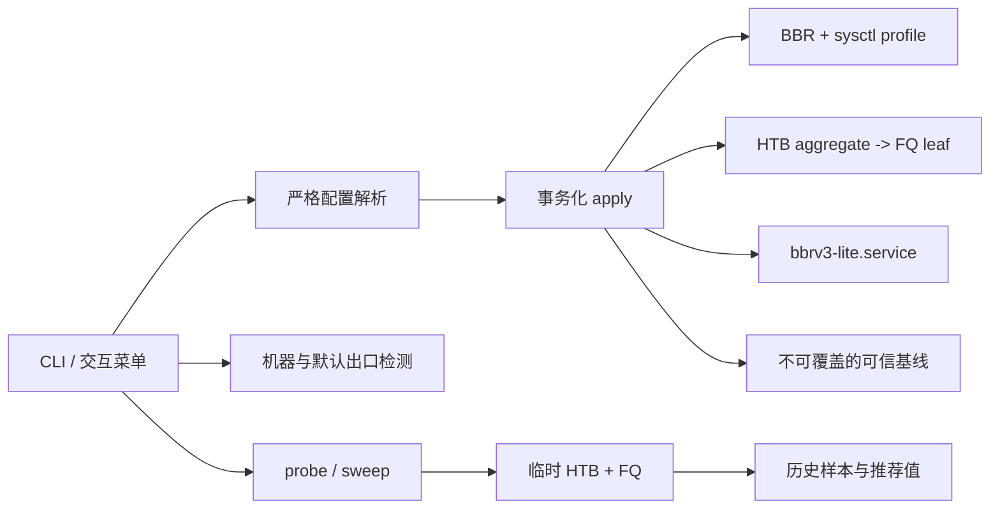

# BBRv3 Lite

BBRv3 Lite 是面向 Debian/Ubuntu VPS 的可测量 TCP 调优工具。它把原项目中可靠的 XanMod 安装、BBR/FQ、DNS/IPv6 管理、严格配置、持久化与回滚重新实现，并吸收 tcpfit 的机器画像、iperf3 测量、policer 拐点扫描、并发锁和最早基线保护。

当前版本：v7.0.5

项目不追求“sysctl 越多越好”。默认配置保持克制。命令行 `measure` 只给出结果；交互式 `auto` 会在一次总确认后完成测量、决策、应用和复验，未发现可信拐点时保持纯 FQ。

## 核心能力

- BBR + FQ 基础调优，以及可选的 BDP/RAM 自适应缓冲区。
- `HTB root -> FQ leaf` 接口聚合出口整形，不用 FQ `maxrate` 冒充总限速。
- `iperf3 -J` JSON 探测、粗扫、细扫、边界复测和测速流量统计。
- 三问式自动向导：带宽、测速对端、业务用途；执行前集中展示耗时、流量和落盘位置。
- 公共 iperf3 节点先按 RTT 筛选，再用低流量真实会话排除繁忙或伪开放端口；正式样本短暂失败会自动重试。
- 交互式子菜单会停留在当前模块，结果确认后再清屏重绘；只有选择 `0` 才返回主菜单。
- IPv4 优先、IPv6 兜底的默认出口检测；不会遍历修改 Docker/veth/bridge 接口。
- 全局 `flock`，防止两个进程同时修改 sysctl、qdisc 或配置。
- 严格 `KEY=VALUE` 白名单解析，配置文件从不被 shell `source`。
- 首次可信基线以完成标记原子提交，不完整快照不会被误当成可信基线；测试中断或应用失败时恢复操作前 qdisc。
- 一个配置、一个 systemd 服务、一个发布脚本，不产生竞争 root qdisc 的服务。
- 官方 XanMod APT 安装、Secure Boot/容器检查、CPU level 保守选择和 APT 网络组件保护。
- DNS 和 IPv6 各自独立备份、独立恢复，不把无关系统改动塞进一次“大回滚”。

## 架构



仓库源码位于 `src/`，发布时由 `scripts/build.sh` 按固定顺序生成根目录的 `net-tcp-tune.sh`。用户仍然可以只下载一个文件，维护和测试则按模块进行。

## 安装

推荐使用下面这一行：安装最新 GitHub Release、校验 `SHA256SUMS`，然后直接打开菜单：

```bash
curl -fsSL https://raw.githubusercontent.com/ike-sh/bbrv3-lite/main/install-alias.sh | bash -s -- --run
```

`--run` 使用安装后的绝对路径启动，并从 `/dev/tty` 重新接入交互输入，因此不会被旧版同名 shell 函数遮蔽。只安装、不进入菜单时去掉 `--run`，随后执行 `bbr version`。

如果仓库已有版本 tag、但 GitHub Release 资产尚未生成，安装器会明确提示并从同一个不可变 tag 下载脚本和校验文件。它不会静默退回可变的 `main`。安装完成后若旧版 shell 函数仍遮蔽 `/usr/local/bin/bbr`，执行：

```bash
unset -f bbr 2>/dev/null
hash -r
```

测试尚未发布的 `main` 分支时必须显式选择 channel；它同样校验仓库中的 `SHA256SUMS`：

```bash
bash /tmp/install-bbrv3-lite.sh --channel main
```

root 用户默认安装到 `/usr/local/bin/bbr`；普通用户安装到 `~/.local/bin/bbr`。普通用户仍需使用 `sudo bbr ...` 执行会修改系统的命令。

也可以直接下载单文件：

```bash
curl -fsSLO https://github.com/ike-sh/bbrv3-lite/releases/latest/download/net-tcp-tune.sh
curl -fsSLO https://github.com/ike-sh/bbrv3-lite/releases/latest/download/SHA256SUMS
sha256sum -c SHA256SUMS --ignore-missing
chmod +x net-tcp-tune.sh
sudo ./net-tcp-tune.sh status
```

## 推荐流程

### 最省事：自动向导

```bash
sudo bbr auto
# 或直接运行 sudo bbr 选择 1
```

向导只集中询问三类信息：标称带宽（可自动测量或选择仅安装 BBR+FQ）、iperf3 对端（公共节点或自有服务器）和业务用途。确认后依次执行：

1. 保存首次可信基线并安装 BBR + FQ。
2. 已知带宽时先用约 40% 速率做路径预检。
3. 以与最终配置相同的 `HTB -> FQ` 层级粗扫/细扫 policer 边界。
4. 只有发现可信拐点才应用退让后的速率；否则保持 FQ。
5. 验证 sysctl、systemd、qdisc，再做单流和四流复测。

中途任何关键步骤失败都会返回非零，并明确区分“运行时已生效但持久化失败”；不会继续打印“安装成功”。

### 1. 只读检测

```bash
sudo bbr detect
sudo bbr detect --target 你的业务目标或近端iperf服务器
sudo bbr kernel status
```

`detect` 输出内核、虚拟化、内存、默认出口、驱动、MTU、链路速率、RX 队列、BBR 可用性和可选目标 RTT，不修改系统。

### 2. 按需安装 XanMod

如果当前内核没有 BBR，或希望使用包含 BBRv3 的 XanMod：

```bash
sudo bbr kernel install --track lts
sudo reboot
```

重启后再次执行 `sudo bbr kernel status`。XanMod 官方 APT 当前只面向 amd64 Debian 系发行版；ARM64 社区内核不再由本项目自动下载和安装，避免把未经项目控制的第三方内核带入默认信任链。

### 3. 安装基础调优

推荐默认档：

```bash
sudo bbr install --profile balanced
```

高 BDP 线路可以先查看自适应计算结果，再应用：

```bash
sudo bbr explain --profile adaptive --role proxy --bandwidth 1000 --rtt 180
sudo bbr install --profile adaptive --role proxy --bandwidth 1000 --rtt 180
```

`balanced` 使用 16 MiB TCP 自动调优上限。`adaptive` 使用 `2 × BDP`，同时受 4 MiB 下限、RAM/32 和 256 MiB 绝对上限约束。两种 profile 都不会修改 `tcp_mem`、`tcp_adv_win_scale`、TIME_WAIT、端口范围、VM、文件句柄或 RPS/RFS。

### 4. 准备可信 iperf3 对端

优先使用同机房或低 RTT 的自有服务器：

```bash
# 对端
iperf3 -s

# 本机安装测量依赖
sudo bbr measure deps
```

自动向导可在用户明确选择后，从 Leaseweb、OVH、Clouvider 的公共测速节点中筛选 120ms 内的对端，并对公开端口执行 1 秒、1 Mbit/s 的真实 iperf3 预检，不再把“TCP 端口已打开”误判为“测速服务可用”。正式样本失败会输出服务端或超时原因并最多尝试 3 次，再失败则安全结束并恢复操作前 qdisc。公共节点仍可能限速或路径不稳定；自有、同机房或低 RTT 的 iperf3 服务器始终是推荐方案。测量结果代表 VPS 到该对端路径，不代表所有业务目的地。

### 5. 探测与扫描

先探测可用吞吐：

```bash
sudo bbr measure probe --peer 192.0.2.10 --port 5201 --duration 10 --parallel 4
```

自动扫描 policer 拐点：

```bash
sudo bbr measure sweep --peer 192.0.2.10 --nominal 500
```

也可以控制扫描区间：

```bash
sudo bbr measure sweep \
  --peer 192.0.2.10 \
  --low 350 --high 600 --step 25 \
  --duration 8 --parallel 1 \
  --margin 3 --loss-threshold 0.1 --cap 5000
```

扫描流程：

1. 保存操作前 qdisc 和接口流量计数器。
2. 使用 root FQ 做两次不超过 5 秒的单流不限速 JSON 测试并取中位数；超过 `--cap` 时停止扫描。
3. 建立低速率重传本底。
4. 使用与最终部署完全相同的 HTB/FQ 层级向上粗扫。
5. 发现重传比例跳变后细扫边界。
6. 对最后干净档位退让 `--margin`，再进行两次确认测试。
7. 保存样本并恢复操作前 qdisc。

结果保存在 `/var/lib/bbrv3-lite/history/`。这里显示的 `RETRANS_RATIO_EST_PERCENT` 是“iperf3 retransmits / 按 1448 字节估算的 TCP 段数”，用于寻找相对跳变，不是抓包意义上的真实丢包率。

扫描同时观察相对重传跳变和吞吐增益连续停滞。扫描到上界仍无可信边界时不会错误地把上界当作推荐值，而是保持纯 FQ。不限速路径自身重传过高时，默认拒绝给出 policer 结论；只有显式 `--force-scan` 才继续。

### 6. 试跑和持久化

```bash
# 临时试跑，不写配置、不安装服务
sudo bbr tc trial 420

# 确认业务延迟、吞吐和重传后再持久化
sudo bbr tc enable 420 --knee 440 --margin 3

sudo bbr tc status
sudo bbr tc stats
```

关闭整形但保留 BBR + FQ：

```bash
sudo bbr tc disable
```

## HTB/FQ 参数原则

- HTB 只负责接口聚合出口上限。
- FQ 只负责流隔离和 pacing，不设置每流 `maxrate`。
- HTB `burst` 根据 `rate / HZ`、MTU 和 32 KiB 下限动态计算，避免固定小 bucket 在高速率下限制吞吐。
- `cburst` 使用 `2 × MTU`；单 class 场景的 quantum 使用 `10 × MTU`，最大 60000 字节。
- 固定 handle 为 `1:`、`1:10`、`10:`，重复执行使用 `replace`，不会不断叠加层级。
- FQ/FQ-CoDel 会保存并重放 `tc qdisc show` 可恢复的参数；发现未知 root qdisc（例如自建 CAKE）时拒绝覆盖。

本工具只处理 egress，不自动创建 IFB，也不做 ingress shaping。

## 配置和持久化

配置文件：`/etc/bbrv3-lite.conf`

```ini
SCHEMA_VERSION=1
BBR_ENABLED=1
SYSCTL_PROFILE=adaptive
ROLE=proxy
BANDWIDTH_MBIT=1000
RTT_MS=180
TC_ENABLED=1
TC_INTERFACE=auto
TC_RATE_MBIT=420
TC_KNEE_MBIT=440
TC_MARGIN_PERCENT=3
INITCWND=0
INITRWND=0
```

配置只允许已知键和受限字符；生产环境要求 root 所有，权限为 `600` 或 `644`。`INITCWND/INITRWND` 默认保持 0，不覆盖路由默认值。

唯一持久化服务为 `bbrv3-lite.service`。unit 只执行：

```text
/usr/local/lib/bbrv3-lite/net-tcp-tune.sh apply
```

网卡、速率和 profile 始终从配置文件读取，不会硬编码进 systemd unit。

## 基线、迁移和恢复

第一次修改前会在 `/var/lib/bbrv3-lite/baseline/` 保存：

- 配置、sysctl 文件和新旧 systemd unit 的存在状态及内容。
- 本工具会修改的运行时 sysctl 值。
- 默认出口、qdisc/class 文本快照、完整 IPv4/IPv6 路由诊断快照，以及默认路由窗口参数。
- schema、脚本版本、时间和 provenance。

`manifest` 是快照完成标记，只有全部关键文件保存成功后才出现。断电或中断留下的不完整目录会在下次操作前安全清理。基线一旦完成就不会覆盖。如果检测到旧调优痕迹但没有可信备份，安装会中止。只有明确接受当前状态为恢复起点时才执行：

```bash
sudo bbr baseline adopt
```

v6 的 `balanced-minimal`、`TC_BASELINE_MBIT`、`TC_PERCENT` 和旧 service 会在已有 `/var/lib/bbrv3-lite/original` 且能保存旧版持久化脚本的前提下迁移；新基线引用旧原始备份，旧备份不会删除。如果缺少其中任一项，工具会拒绝伪造“出厂基线”。

恢复首次可信基线：

```bash
sudo bbr restore
```

完整卸载会先恢复 TCP/qdisc、DNS、IPv6 中实际存在的基线，再删除服务、配置和 `bbr` 命令，同时保留备份和测量历史：

```bash
sudo bbr uninstall
```

完全卸载并在恢复成功后永久删除状态目录必须显式指定：

```bash
sudo bbr uninstall --purge-state
```

如果早期版本已经先删除了基线，工具会明确提示无法精确恢复运行时 sysctl/qdisc，但仍会删除残留服务、配置和 `bbr` 命令，不会再声称保留不存在的基线。当前 shell 若缓存过命令，执行 `unset -f bbr 2>/dev/null; hash -r`，或重新登录。

## DNS 与 IPv6

DNS 使用独立的 systemd-resolved drop-in：

```bash
sudo bbr dns apply auto   # 853 可达用 DoT，否则明确降级普通 DNS
sudo bbr dns apply dot
sudo bbr dns status
sudo bbr dns restore
```

v7 不再自动安装和改写 dnscrypt-proxy。DoH 代理涉及本地 53 端口、发行版配置和额外软件生命周期，应该作为独立组件管理，而不是 BBR 安装的隐式副作用。

IPv6 管理：

```bash
sudo bbr ipv6 disable temporary
sudo bbr ipv6 disable permanent
sudo bbr ipv6 status
sudo bbr ipv6 restore
```

IPv6 恢复使用首次记录的 `all/default/lo.disable_ipv6` 原值，不假设原始值一定为 0。

## 完整命令

```bash
bbr help
```

无参数并连接终端时显示精简交互菜单。执行操作后会停留在所属子菜单，按 Enter 清理本次输出并继续；选择 `0` 才返回主菜单。自动化和排障建议使用显式子命令。

## 支持范围

| 环境 | 支持情况 |
| --- | --- |
| Debian 12/13 amd64 KVM | 主要支持 |
| Ubuntu 22.04/24.04 amd64 KVM | 主要支持 |
| 其他 systemd Debian/Ubuntu | 尽力支持 |
| ARM64 | BBR/TC 可用时可运行；不自动安装社区内核 |
| OpenVZ/LXC/Docker | 只读检测；通常不能修改宿主内核/qdisc |
| 非 systemd 系统 | 不支持持久化和 DNS 模块 |

XanMod 包和支持 codename 会变化，安装逻辑从官方仓库实际候选中选择，不写死内核版本。参见 [XanMod 官方安装说明](https://xanmod.org/)。

## 开发与验证

```bash
bash scripts/build.sh
bash scripts/validate.sh
```

真实 TC 集成测试必须放在一次性容器或网络命名空间中：

```bash
docker run --rm --cap-add NET_ADMIN -v "$PWD:/src:ro" debian:12 \
  bash -lc 'apt-get update -qq && apt-get install -y -qq iproute2 procps util-linux >/dev/null && bash /src/tests/integration_tc.sh'
```

生成 release 校验文件：

```bash
bash scripts/release.sh
```

tag 推送会触发 Release 工作流，验证 tag 与脚本版本一致，并发布 `net-tcp-tune.sh`、`install-alias.sh` 与 `SHA256SUMS`。安装器仍能处理“只有 tag、没有 Release 资产”的历史版本。模块边界见 [docs/MODULES.md](docs/MODULES.md)。

## v7.0.1 修复重点

- 修复无参数交互入口通过 `&&` 调用菜单、导致 Bash 抑制函数内部错误退出的问题。
- 修复从进程替换运行时无法安装持久化副本、服务不存在仍打印成功的问题。
- 修复只有 tag 没有 GitHub Release 时安装器直接 404；新增自动发布 Release 资产的工作流。
- 将内核、DNS、IPv6、TC 入口从“仅显示状态”改为可执行的管理子菜单。
- 新增三问自动调优、公共对端筛选、路径预检、单双流复验和实际流量记录。
- 修复扫描到上界没有拐点却仍推荐最高档的决策错误，并加入吞吐增益停滞判据。
- 状态页不再显示 `unknown Mbps`、`not measured ms`，并明确说明普通 `bbr` 状态不能证明 BBRv3。

## v7.0.2 修复重点

- 修复父进程持有全局锁时启动 systemd 服务，导致服务内 `apply` 无法取得同一把锁并启动失败。
- 服务启动前主动交接锁，完成后为自动向导重新取得锁；systemd 启动阶段最多等待 30 秒，并在失败时直接打印服务状态。
- 测量依赖只安装实际缺少的软件包；已有 `iproute2`、`util-linux`、`procps` 时不再显式交给 APT 升级。
- 新增 `--run`，安装与打开菜单合并为一行命令。

## v7.0.3 修复重点

- 统一“恢复”“卸载”“完全卸载”的语义：卸载不再只删除持久化组件而保留快捷命令。
- 卸载按 TCP → DNS → IPv6 → `bbr` 命令 → 可选状态目录的顺序执行，恢复失败时保留后续恢复能力。
- 删除标准安装位置中带项目标记的 `bbr`，并清理旧版本写入 shell rc 文件的函数块；不会删除无项目标记的同名文件。
- 卸载完成后交互菜单直接退出，并根据状态目录是否真实存在输出准确结果。

## v7.0.4 修复重点

- 子菜单改为连续操作模式，操作结果暂停确认后清屏重绘，避免每次跳回主菜单和终端内容无限累积。
- 公共测速节点增加低流量 iperf3 会话预检，正式测试增加可诊断错误信息和有限重试。
- 修复首次测速失败被误判为成功、继续使用零步长计算而触发 `division by 0`；任何失败都会恢复操作前 qdisc。
- 兼容新内核 FQ 输出中的只读 `bands`、`priomap`、`weights` 字段，恢复基线时不再把它们错误重放给 `tc`。

## v7.0.5 修复重点

- 修复部分新内核不支持对现有 HTB root 执行 `qdisc replace`，导致自动扫描只能完成第一个速率档位的问题。
- 扫描层级已经存在时只原地更新 `1:10` HTB class 的速率、burst 和 quantum，不再重复重建 root qdisc 与 FQ leaf。
- 回滚到上一个整形速率也使用相同的原地更新路径，并新增连续变速的模拟测试和 Debian 12/13 真实 TC 测试。

## v7 与旧版的差异

- 删除八千行单文件中交织的 legacy/v6 双实现，改为模块源码、单文件发布。
- 删除激进 sysctl、固定 `initcwnd=32`、多网卡 root qdisc 覆盖和第二套 TC service。
- 删除自动执行第三方测速/回程脚本和社区 ARM64 内核安装。
- 删除“一键修改内核、DNS、IPv6、TCP”的大范围自动化；各模块独立确认、独立恢复。
- 新增测量历史、JSON 拐点扫描、动态 HTB bucket、可信基线和 release-only 更新。

## 项目来源与许可证

本项目延续 [ike-sh/bbrv3-lite](https://github.com/ike-sh/bbrv3-lite) 和其上游 `vps-tcp-tune` 的实用功能，并参考 [Kylin010/tcpfit](https://github.com/Kylin010/tcpfit) 的测量工作流。实现已按本项目架构重写，不将 tcpfit 的完整 sysctl 表或固定 TC 参数复制进来。

许可证见 [LICENSE](LICENSE)。使用前请为 VPS 创建快照；内核、sysctl、qdisc 和 DNS 修改都可能导致远程连接中断。
